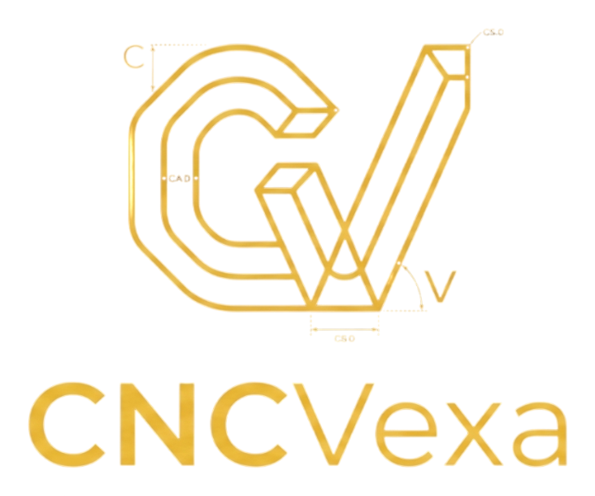

<div align="center">



# CNCVexa Simulator

### Educational CNC simulator for milling and turning

Code editor, macros, tooling, machining cycles, and 2D/3D simulation directly in the browser.

[**Open simulator**](https://cncvexa.com/?lang=en) · [Report an issue](../../issues) · [Suggest an improvement](../../issues)

[Español](README.md) · **English**

</div>

---

## About the project

**CNCVexa Simulator** is a CNC simulator developed to practice CNC programming without relying on desktop software.

The project began as a milling simulator and currently includes two working modes:

- **Mill**, with a configurable table, prismatic workpiece, tools, offsets, and material removal.
- **Lathe**, with cylindrical stock, chuck, turret, X–Z profile, and a 3D model generated by revolution.

The application runs completely in the browser and can be used through GitHub Pages at the custom domain.

> [!WARNING]
> CNCVexa Simulator is an educational tool. Before running a program on a real machine, always verify offsets, tools, workholding, travel limits, compensation, *single block*, and *dry run*.

---

## Simulation modes

### Milling

- Configurable work table.
- Workpiece positioning on the table.
- Millimeter or inch dimensions.
- 2D toolpath view.
- 3D machining simulation.
- Adjustable graphics quality.
- Independent rapid and cutting path lines.
- Work coordinate systems `G54` through `G59`.
- Library of end mills, drills, ball end mills, face mills, and countersinks.
- Tool table with independent T numbers.
- Custom tools.
- Tool entry and exit outside the material.

Interpreted functions include:

```text
G00 G01 G02 G03
G15 G16
G17 G18 G19
G20 G21
G40 G41 G42
G43 G49
G54–G59
G68 G69
G73 G81–G89
G90 G91
G94
```

It also includes subprograms, polar coordinates, coordinate-system rotation, and full circles in different planes.

### Lathe

- Solid or tubular stock.
- Configurable diameter and length.
- Chuck and jaws.
- Turret with tool stations.
- OD, ID, grooving, threading, and drilling tools.
- X–Z profile view.
- 3D model generated by revolution.
- X programmed as diameter.
- Constant surface speed.
- Feed per minute or per revolution.
- Approximate collision detection.
- Visualization of threads, grooves, and tool changes.

Available or partially simulated functions:

```text
G00 G01 G02 G03
G18
G20 G21
G40 G41 G42
G50
G54–G59
G70 G71 G72 G73
G74 G75 G76
G80 G83
G90 G91
G94 G95
G96 G97
```

Lathe mode recognizes tools in this format:

```gcode
T0101
```

where the first two digits identify the turret station and the last two identify the offset.

---

## CNC editor

- Line numbers.
- Autocomplete for G codes, M codes, and Macro commands.
- Description and example for each code.
- Validation before execution.
- Automatic formatting.
- History with `Ctrl + Z` and `Ctrl + Y`.
- Import through the file picker or drag and drop.
- Continuous and single-block execution.
- Diagnostics, variables, and trace panels.

Accepted formats:

```text
.NC
.TAP
.TXT
.CNC
.GCODE
.CNCVEXA
```

---

## Custom Macro

The interpreter includes support for variables and flow control:

```gcode
#100 = 0

WHILE [#100 GT -10] DO1
    #100 = [#100 - 1]
END1

IF [#100 GE -10] GOTO 100
```

Available functions:

```text
SIN COS TAN
SQRT ABS
ROUND FIX FUP
```

Also supported:

- Local and common variables.
- `IF / THEN`.
- `IF / GOTO`.
- `WHILE / DO / END`.
- Subprograms with `M98` and `M99`.
- Macro calls through `G65`.

---

## Program and project files

### Save program

Generates a CNC file containing the editor contents:

```text
cnc_program.nc
```

### Save project

Generates a `.cncvexa` file containing the code and complete configuration:

- Machine type.
- Table, workpiece, or stock.
- Offsets.
- Tool table.
- Units.
- Simulation quality.
- Camera and view mode.
- Toolpath display preferences.

This allows the job to be reopened later exactly as it was left.

---

## Online use

Open the published version:

**https://cncvexa.com/?lang=en**

No Python installation or always-on server is required.

### Install as an app

CNCVexa includes a web app manifest and offline support. In Chrome or Edge, use the **Install CNCVexa** icon in the address bar; on Android, choose **Install app** or **Add to Home screen**.

---

## Controls

### Editor

| Action | Shortcut |
|---|---|
| New program | `Ctrl + N` |
| Open program | `Ctrl + O` |
| Save program | `Ctrl + S` |
| Undo | `Ctrl + Z` |
| Redo | `Ctrl + Y` |
| Autocomplete | `Ctrl + Space` |
| Format | `Alt + Shift + F` |

### Simulation

| Action | Shortcut |
|---|---|
| Run | `F5` |
| Validate | `F7` |
| Single block | `F10` |
| Reset | `Ctrl + R` |
| Show or hide bottom panel | `Ctrl + J` |
| Maximize simulator | `Shift + F11` |

### 3D camera

- Left mouse button: rotate.
- `Shift` + drag: pan.
- Right mouse button: pan.
- Mouse wheel: zoom in or out.
- Double click: fit the scene.

---

## Milling example

```gcode
O0001
G17 G21 G90 G40 G49 G80
T03 M06
G54
M03 S5000

G00 X0 Y0
G43 H03 Z20
G01 Z-5 F150
G01 X50 F300
Y30
X0
Y0

G00 Z20
M05
M30
```

## Lathe example

```gcode
O0002
G18 G21 G90 G95
G50 S3000
T0101
G96 S180 M03
G54

G00 X28 Z2
G01 Z0 F0.20
X0
G00 X26 Z1
G01 Z-15
X20
Z-25
X15
Z-35
X10
Z-40

G00 X40 Z10
M05
M30
```

---

## General structure

```text
CNCVexa-Simulator/
├── .github/
│   ├── workflows/        # Automated validation
│   └── FUNDING.yml       # GitHub support link
├── docs/                 # GitHub Pages site
│   ├── assets/
│   ├── js/
│   ├── index.html
│   ├── privacy.html
│   ├── site.webmanifest
│   ├── sw.js
│   ├── robots.txt
│   ├── sitemap.xml
│   ├── CNAME
│   └── .nojekyll
├── tests/                # Mill, lathe, and PWA smoke tests
├── README.md
├── README.en.md
├── LICENSE
└── package.json
```

Run the local validation with:

```bash
npm test
```

---

## Simulator status

The interpreter is focused on learning and visual validation. Some cycles, compensation behavior, and alarms may differ depending on controller model, installed options, and machine manufacturer.

Functions marked **Partial** or **Reference** inside the application do not yet represent the complete semantics of an industrial CNC controller.

---

## Contributions

To report an issue:

1. Open an **Issue**.
2. Attach or paste the CNC program.
3. Indicate whether it occurred in Mill or Lathe mode.
4. Explain the expected result and what the simulator displayed.
5. Add a screenshot whenever possible.

---

## ☕ Support the project

CNCVexa Simulator is free and will remain available to the community.

If you enjoy CNCVexa or simply like what I’m building, you can support my work on Ko-fi. Your support helps me keep developing new features, improving the simulation, and maintaining the project.

**[☕ Support me on Ko-fi](https://ko-fi.com/silverpsycho)**

Using, sharing, and reporting issues is already a great way to support the project. 💙

---

## Author

Developed by **SilverPsycho**

GitHub: [@SilverPsychoo](https://github.com/SilverPsychoo)

---

## Notice

CNCVexa Simulator is an independent project for educational purposes.  
It does not represent or replace any specific industrial CNC controller.
