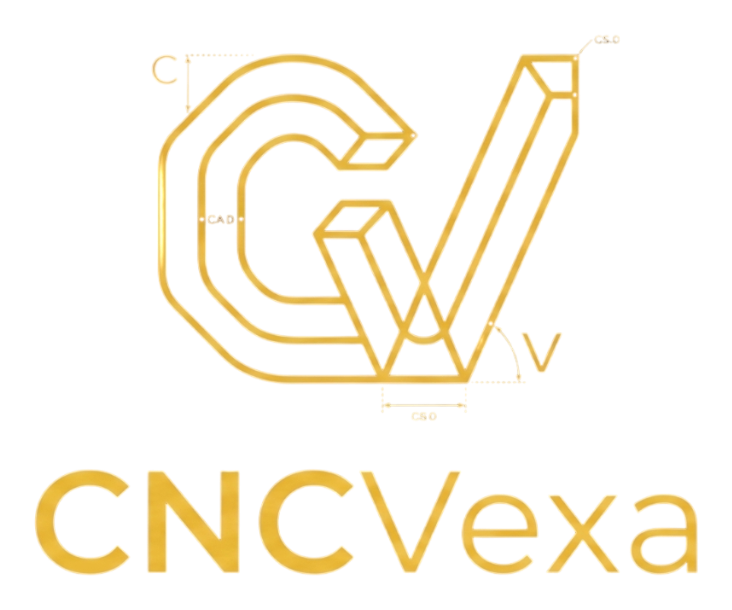

<div align="center">



# CNCVexa Simulator

### Simulador CNC educativo para fresadora y torno

Editor de código, macros, herramientas, ciclos de maquinado y simulación 2D/3D directamente desde el navegador.

[**Abrir simulador**](https://cncvexa.com/) · [Reportar un problema](../../issues) · [Proponer una mejora](../../issues)

**Español** · [English](README.en.md)

</div>

---

## Acerca del proyecto

**CNCVexa Simulator** es un simulador CNC desarrollado para practicar programación CNC sin depender de software de escritorio.

El proyecto comenzó como un simulador de fresadora y actualmente incluye dos modos de trabajo:

- **Fresa**, con mesa, pieza prismática, herramientas, offsets y remoción de material.
- **Torno**, con barra cilíndrica, plato, torreta, perfil X–Z y modelo 3D por revolución.

La aplicación funciona completamente en el navegador y puede utilizarse desde GitHub Pages.
La interfaz también se adapta a teléfonos y tabletas, con navegación móvil entre editor, simulación y paneles, además de controles táctiles.

> [!WARNING]
> CNCVexa Simulator es una herramienta educativa. Antes de ejecutar un programa en una máquina real deben revisarse offsets, herramientas, sujeción, límites de carrera, compensaciones, *single block* y *dry run*.

---

## Reproducción y detalle

- La velocidad va de **1× a 1000×**. A 1× los movimientos siguen el avance `F`, las unidades y el modo de avance del programa; en torno, X se considera un diámetro. Los rápidos usan un avance del modelo de 12 000 mm/min, independiente de F.
- **Avance por bloque / F10** ejecuta el bloque siguiente y se detiene al terminarlo. Los segmentos de un arco o ciclo permanecen en el mismo bloque.
- En 2D se distingue la trayectoria pendiente de la recorrida. Volver a ejecutar después del final repite la animación desde el inicio.
- Al pasar el cursor sobre una línea 2D se resalta el bloque de trayectoria y aparecen su código y extremos XYZ. Los arcos se resaltan completos.
- Al pasar el cursor sobre un vértice 2D aparecen su línea, código y coordenadas X, Y y Z en milímetros. Si coinciden varias posiciones, se muestran sus distintos valores de Z y líneas.
- Los cortadores 3D respetan el diámetro, longitud y ángulo configurados, con surcos helicoidales, punta esférica, punta de broca y plaquitas de planeado. El torno distingue plaquitas de exterior/acabado, ranurado y roscado, barra de mandrinar y broca axial.
- Básico, Normal, Alto y Máximo cambian la malla de la pieza y de las herramientas; Máximo conserva todas las muestras de material y Básico usa una malla más ligera y sombreado por caras. Cambiar el detalle conserva la pieza mecanizada.
- El detalle predeterminado es **Máximo**: resolución de remoción de 0.5 mm en fresa y perfil de 0.25 mm en torno. Las resoluciones de proyectos guardados se conservan.
- La remoción se calcula en un Worker mediante lotes limitados por tiempo. WebGL 2 dibuja la superficie y herramientas con volumen; si no está disponible, se utiliza el renderizador de Canvas.

El tiempo de movimiento modela el avance programado; no incluye aceleración de ejes ni todos los tiempos auxiliares de una máquina concreta. La fresadora conserva un modelo de altura de la superficie, por lo que no representa socavados laterales ni cavidades internas cerradas.

## Modos de simulación

### Fresadora

- Mesa de trabajo configurable.
- Pieza posicionable sobre la mesa.
- Dimensiones en milímetros o pulgadas.
- Vista de trayectoria 2D.
- Simulación de maquinado 3D.
- Calidad gráfica ajustable.
- Líneas de rápido y corte independientes.
- Sistemas de trabajo `G54` a `G59`.
- Biblioteca de fresas, brocas, puntas bola, planeadores y avellanadores.
- Tabla de herramientas con números T independientes.
- Herramientas personalizadas.
- Entrada y salida de la herramienta fuera del material.

Entre las funciones interpretadas se encuentran:

```text
G00 G01 G02 G03
G15 G16
G17 G18 G19
G20 G21
G40 G41 G42
G43 G49
G54–G59
G68 G69
G73 G81–G89
G90 G91
G94
```

También incluye subprogramas, coordenadas polares, rotación del sistema de coordenadas y círculos completos en distintos planos.

### Torno

- Barra maciza o tubular.
- Diámetro y longitud configurables.
- Plato y mordazas.
- Torreta con estaciones de herramienta.
- Herramientas exteriores, interiores, de ranurado, roscado y barrenado.
- Vista de perfil X–Z.
- Modelo 3D generado por revolución.
- X programado como diámetro.
- Velocidad de corte constante.
- Avance por minuto o por revolución.
- Detección aproximada de colisiones.
- Visualización de roscas, ranuras y cambios de herramienta.

Funciones disponibles o parcialmente simuladas:

```text
G00 G01 G02 G03
G18
G20 G21
G40 G41 G42
G50
G54–G59
G70 G71 G72 G73
G74 G75 G76
G80 G83
G90 G91
G94 G95
G96 G97
```

El modo Torno reconoce herramientas en formato:

```gcode
T0101
```

donde los primeros dos dígitos identifican la estación y los últimos dos el corrector.

---

## Editor CNC

- Números de línea.
- Autocompletado de códigos G, códigos M y comandos Macro.
- Descripción y ejemplo de cada código.
- Validación antes de ejecutar.
- Formateo automático.
- Historial con `Ctrl + Z` y `Ctrl + Y`.
- Importación mediante selector o arrastrando archivos.
- Ejecución continua y bloque por bloque.
- Panel de diagnósticos, variables y traza.

Formatos aceptados:

```text
.NC
.TAP
.TXT
.CNC
.GCODE
.CNCVEXA
```

---

## Custom Macro

El intérprete incluye soporte para variables y control de flujo:

```gcode
#100 = 0

WHILE [#100 GT -10] DO1
    #100 = [#100 - 1]
END1

IF [#100 GE -10] GOTO 100
```

Funciones disponibles:

```text
SIN COS TAN
SQRT ABS
ROUND FIX FUP
```

También se admiten:

- Variables locales y comunes.
- `IF / THEN`.
- `IF / GOTO`.
- `WHILE / DO / END`.
- Subprogramas con `M98` y `M99`.
- Llamadas Macro mediante `G65`.

---

## Archivos de programa y proyecto

### Guardar programa

Genera un archivo CNC con el contenido del editor:

```text
programa.nc
```

### Guardar proyecto

Genera un archivo `.cncvexa` con el código y la configuración completa:

- Tipo de máquina.
- Mesa, pieza o barra.
- Offsets.
- Tabla de herramientas.
- Unidades.
- Calidad de simulación.
- Cámara y modo de vista.
- Preferencias de trayectorias.

Esto permite abrir después el trabajo exactamente como se dejó.

---

## Uso en línea

Abre la versión publicada:

**https://cncvexa.com/**

No es necesario instalar Python ni mantener un servidor encendido.

### Instalar como aplicación

CNCVexa incluye manifiesto y soporte sin conexión. En Chrome o Edge puede instalarse desde el icono **Instalar CNCVexa** de la barra de direcciones; en Android aparece en **Instalar aplicación** o **Agregar a pantalla principal**.

---

## Uso local

Extrae el ZIP completo. En Windows, abre `Iniciar CNCVexa.bat` en el paquete de la aplicación o `Iniciar_CNCVexa.bat` en el repositorio. Se necesita Python 3.8 o posterior.

El lanzador sirve la carpeta de esa copia, elige un puerto disponible y abre el navegador cuando el servidor está listo. La ventana del servidor debe permanecer abierta. También puedes ejecutar `python iniciar_cncvexa.py` desde la carpeta del lanzador.

La copia local evita la caché de versiones anteriores; el soporte sin conexión se conserva en el sitio publicado.

---

## Controles

### Editor

| Acción | Atajo |
|---|---|
| Nuevo programa | `Ctrl + N` |
| Abrir programa | `Ctrl + O` |
| Guardar programa | `Ctrl + S` |
| Deshacer | `Ctrl + Z` |
| Rehacer | `Ctrl + Y` |
| Autocompletado | `Ctrl + Espacio` |
| Formatear | `Alt + Shift + F` |

### Simulación

| Acción | Atajo |
|---|---|
| Ejecutar | `F5` |
| Validar | `F7` |
| Bloque por bloque | `F10` |
| Reiniciar | `Ctrl + R` |
| Mostrar u ocultar panel inferior | `Ctrl + J` |
| Maximizar simulador | `Shift + F11` |

### Cámara 3D

- Botón izquierdo: rotar.
- `Shift` + arrastrar: desplazar.
- Botón derecho: desplazar.
- Rueda: acercar o alejar.
- Doble clic: encuadrar la escena.

---

## Ejemplo de fresadora

```gcode
O0001
G17 G21 G90 G40 G49 G80
T03 M06
G54
M03 S5000

G00 X0 Y0
G43 H03 Z20
G01 Z-5 F150
G01 X50 F300
Y30
X0
Y0

G00 Z20
M05
M30
```

## Ejemplo de torno

```gcode
O0002
G18 G21 G90 G95
G50 S3000
T0101
G96 S180 M03
G54

G00 X28 Z2
G01 Z0 F0.20
X0
G00 X26 Z1
G01 Z-15
X20
Z-25
X15
Z-35
X10
Z-40

G00 X40 Z10
M05
M30
```

---

## Estructura general

```text
CNCVexa-Simulator/
├── .github/
│   ├── workflows/        # Validación automática
│   └── FUNDING.yml       # Enlace de apoyo en GitHub
├── docs/                 # Sitio publicado con GitHub Pages
│   ├── assets/
│   ├── js/
│   ├── index.html
│   ├── privacy.html
│   ├── site.webmanifest
│   ├── sw.js
│   ├── robots.txt
│   ├── sitemap.xml
│   ├── CNAME
│   └── .nojekyll
├── tests/                # Pruebas de fresa, torno y PWA
├── README.md
├── README.en.md
├── LICENSE
└── package.json
```

Para ejecutar la verificación local:

```bash
npm test
```

---

## Estado del simulador

La interpretación está enfocada en aprendizaje y validación visual. Algunos ciclos, compensaciones y alarmas pueden comportarse de manera distinta según el modelo del control, las opciones instaladas y el fabricante de la máquina.

Las funciones marcadas como **Parcial** o **Referencia** dentro de la aplicación todavía no representan toda la semántica de un control industrial.

---

## Contribuciones

Para reportar un error:

1. Abre un **Issue**.
2. Adjunta o pega el programa CNC.
3. Indica si ocurrió en Fresa o Torno.
4. Explica el resultado esperado y lo que mostró el simulador.
5. Agrega una captura cuando sea posible.

---

## ☕ Apoya el proyecto

CNCVexa Simulator es gratuito y seguirá disponible para la comunidad.

Si disfrutas CNCVexa o simplemente te gusta lo que estoy construyendo, puedes apoyar mi trabajo en Ko-fi. Tu apoyo me ayuda a seguir desarrollando nuevas funciones, mejorando la simulación y manteniendo el proyecto.

**[☕ Apoyarme en Ko-fi](https://ko-fi.com/silverpsycho)**

Usar, compartir y reportar problemas ya es una gran forma de apoyar el proyecto. 💙

---

## Autor

Desarrollado por **SilverPsycho**

GitHub: [@SilverPsychoo](https://github.com/SilverPsychoo)

---

## Aviso

CNCVexa Simulator es un proyecto independiente con fines educativos.  
No representa ni sustituye a un control CNC industrial específico.
